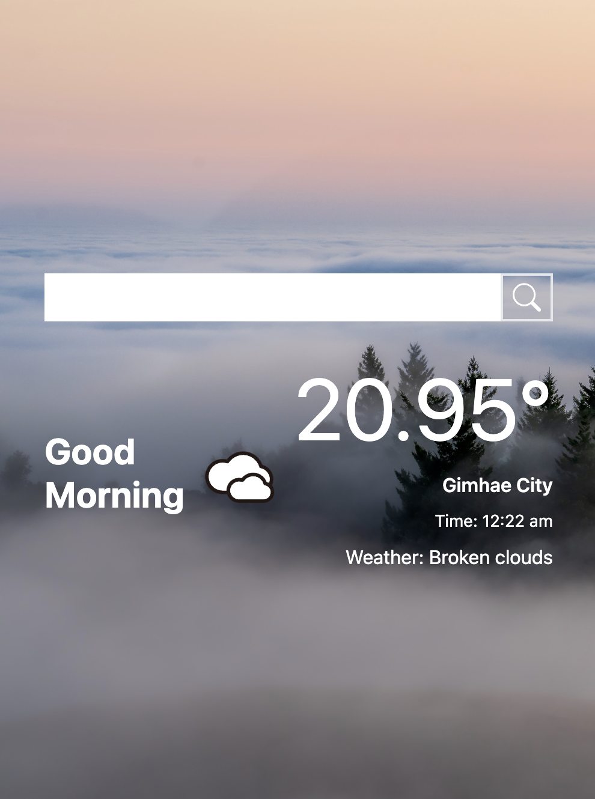

# Pocket Weather Info App

Welcome to the Pocket Weather Info App! This web application was created using Vite, React, and Tailwind CSS to provide you with quick and easy access to local and international weather information.

## Features

- **Local Weather:** Quickly check the current weather conditions for your location.
- **International Weather:** Search for weather information in different countries or cities.
- **Responsive Design:** The app is designed to work seamlessly on both desktop and mobile devices.

## Getting Started

To get started with the Pocket Weather Info App, follow these steps:

1. **Visit the App:** You can access the app by following this link: [Pocket Weather Info App](https://pocketweatherinfo.netlify.app/)

2. **Local Weather:**

   - When you first visit the app, it will automatically detect your location and display the local weather information.

3. **International Weather:**
   - To search for weather information in different countries or cities, simply use the search bar at the top of the page. Enter the location you want to check, and the app will provide you with up-to-date weather data.

## Technologies Used

- [Vite](https://vitejs.dev/): A fast development build tool for modern web apps.
- [React](https://reactjs.org/): A JavaScript library for building user interfaces.
- [Tailwind CSS](https://tailwindcss.com/): A utility-first CSS framework for quickly designing and customizing your website's appearance.

## Local Development

If you want to run the app locally or contribute to its development, you can follow these steps:

1. **Clone the Repository:**

git clone https://github.com/ajay117/pocket-weather-info.git
cd pocket-weather-info

2. **Install Dependencies:**

npm install

3. **Start the Development Server:**

npm run dev

4. The app should now be running locally at `http://localhost:5173`.

5. You will need and Openweather API Key and should should save it in an .env file as VITE_WEATHER_API_KEY="YOUR API KEY"

## Feedback and Contributions

We welcome feedback and contributions from the community! If you have any suggestions, find a bug, or want to contribute to the project, please feel free to open an issue or submit a pull request on the [GitHub repository](https://github.com/ajay117/pocketweatherinfo).

## Deployment

The Pocket Weather Info App is deployed on [Netlify](https://www.netlify.com/). You can access the live app at [https://pocketweatherinfo.netlify.app/](https://pocketweatherinfo.netlify.app/).

## License

This project is open-source and available under the [MIT License](LICENSE).

Enjoy using the Pocket Weather Info App, and stay updated with the latest weather conditions wherever you are! If you have any questions or need assistance, please don't hesitate to contact us.
